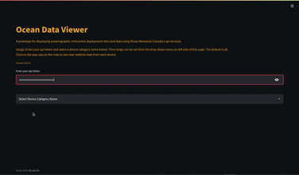

# oceanview-app
A prototype streamlit app for Oceanographic instruments deployment information and near real-time data visualisations.
The app requires a token for Ocean Networks Canada's API services. Get it by registering for an account at https://data.oceannetworks.ca/Login. 

# vizl  
Docker pull:  ``docker pull zesys0/oceanviewstreamlitapp``

## Little Demo

